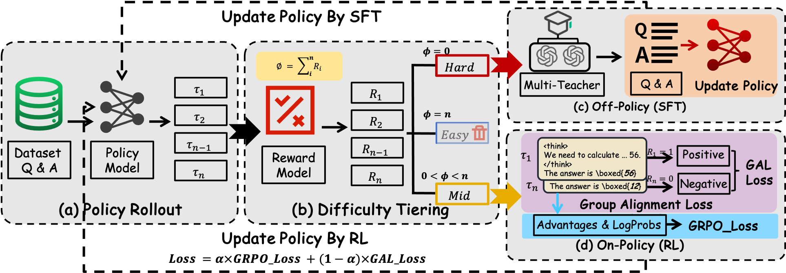

# DYPO

<p align="center">
  <strong>Dynamic Policy Optimization for LLM Reasoning</strong>
</p>

<p align="center">
  <a href="https://arxiv.org/pdf/2604.08926"></a>
  
  
  
</p>

DYPO is a reinforcement learning framework that dynamically routes each prompt to the most suitable training objective based on online rollout performance.

> News: Our paper has been accepted to **ACL 2026 Findings**.
> News: Our dataset will be released soon.

It extends GRPO/PPO with a sample-wise strategy:
- Hard samples (all failed rollouts) -> SFT
- Easy samples (all successful rollouts) -> filtered out
- Partial samples (mixed outcomes) -> RL

## Table of Contents

- [Highlights](#highlights)
- [Method Overview](#method-overview)
- [Paper](#paper)
- [Installation](#installation)
- [Quick Start](#quick-start)
- [Core Hyperparameters](#core-hyperparameters)
- [Project Structure](#project-structure)
- [Citation](#citation)
- [Acknowledgments](#acknowledgments)
- [License](#license)

## Highlights

- Dynamic sample routing driven by rollout success rate
- Hybrid SFT + RL optimization in one training loop
- Built on [verl](https://github.com/volcengine/verl) with Ray/FSDP/vLLM support
- Pluggable reward functions (math-verify, deepscaler, custom)
- Disk-based sample buffer for large-scale runs

## Method Overview

<p align="center">
  
</p>

For each training batch:

1. Generate `n` rollouts per prompt.
2. Compute reward for each rollout.
3. Route samples by success count:
   - `0 / n` success -> Hard -> SFT update queue
   - `n / n` success -> Easy -> skip
   - `1..n-1 / n` success -> Partial -> RL update queue
4. Trigger updates when queue size conditions are met.

## Paper

- Local PDF: [paper/2604.08926.pdf](paper/2604.08926.pdf)
- arXiv: [https://arxiv.org/pdf/2604.08926](https://arxiv.org/pdf/2604.08926)

## Installation

### Requirements

- Python >= 3.10
- PyTorch >= 2.1
- vLLM >= 0.7.3
- Ray >= 2.41.0
- CUDA >= 12.1

### Setup

```bash
git clone https://github.com/YOUR_USERNAME/dypo.git
cd dypo

# install project dependencies
pip install -e ".[vllm,math]"

# optional extra dependencies used by some reward pipelines
pip install deepscaler math-verify
```

## Quick Start

### 1. Prepare Data

Prepare data in Parquet format. See `data/README.md` for schema details.

```python
import pandas as pd

data = [
    {
        "prompt": [{"role": "user", "content": "Solve: What is 17 * 23?"}],
        "data_source": "math_dapo",
        "reward_model": {"ground_truth": "391", "style": "rule"},
    },
]

df = pd.DataFrame(data)
df.to_parquet("data/train.parquet", index=False)
```

### 2. Launch Training

Edit paths in `examples/run_dypo_math.sh` and run:

```bash
bash examples/run_dypo_math.sh
```

## Core Hyperparameters

| Parameter | Default | Description |
|---|---|---|
| `trainer.unify_strategy` | `"switch"` | Routing strategy (`"switch"` for DYPO, `"no"` for standard RL) |
| `trainer.switch_gate` | `0` | Minimum step before routing is enabled |
| `actor_rollout_ref.rollout.n` | `8` | Number of rollouts per prompt |
| `actor_rollout_ref.actor.sft_loss_coef` | `1.0` | SFT loss coefficient for hard samples |
| `actor_rollout_ref.actor.offline_loss_type` | `"sft"` | Hard-sample objective (`"sft"` or `"rl"`) |
| `data.format_penalty_coef` | `0.0` | Penalty for malformed outputs |

## Project Structure

```text
dypo/
├── examples/
│   └── run_dypo_math.sh
├── data/
│   └── README.md
├── paper/
│   └── 2604.08926.pdf
├── verl/
│   ├── trainer/
│   │   ├── main_dypo.py
│   │   ├── config/ppo_trainer_dypo.yaml
│   │   └── ppo/ray_trainer_dypo.py
│   ├── utils/
│   │   ├── dataset/
│   │   └── reward_score/
│   ├── workers/
│   └── mix_src/
└── README.md
```

## Citation

If DYPO is useful for your work, please cite:

```bibtex
@article{dypo2026,
  title={DYPO: Dynamic Policy Optimization for Large Language Model Reasoning},
  author={...},
  journal={arXiv preprint arXiv:2604.08926},
  year={2026},
  eprint={2604.08926},
  archivePrefix={arXiv},
  primaryClass={cs.CL},
  note={Accepted to Findings of ACL 2026}
}
```

## Acknowledgments

This project builds on top of [verl](https://github.com/volcengine/verl). Thanks to the verl team for the excellent training infrastructure.

## License

This project is licensed under Apache-2.0. See [LICENSE](LICENSE) for details.
